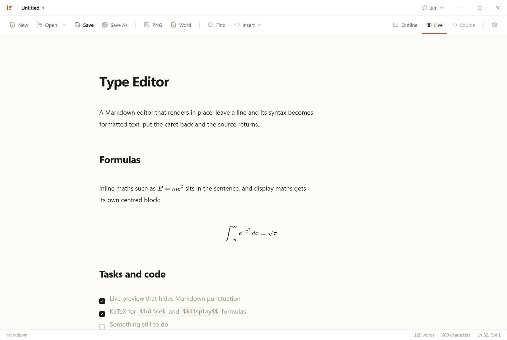
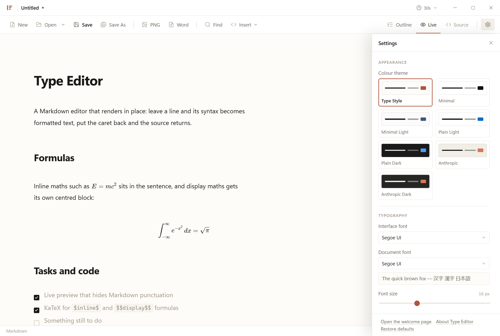

<p align="center">
  
</p>

<h1 align="center">Type Editor</h1>

<p align="center">
  A desktop Markdown editor that renders your document in place, as you type.
</p>

<p align="center">
  <a href="README.zh-CN.md">简体中文</a> · <a href="https://dtio.org">dtio.org</a>
</p>



## What it is

A Markdown file opened in Type Editor reads as a finished document. The
punctuation — `#`, `**`, backticks, link targets — is hidden on every line that
does not hold the caret, and what remains is styled: headings are headings,
tables are tables, formulas are typeset. Move the caret onto a line and its
source comes back for editing.

It is built with Electron, React and CodeMirror 6, and it edits one document at a
time: no tabs, no split view, just the file you are working on.

## Features

**Live preview.** Headings, emphasis, lists, task lists, tables, quotes, code
blocks with syntax highlighting, images and rules, all rendered where they are
written. Moving the caret onto a line reveals that line's Markdown, with a short
fade so the swap is easy to follow.

**LaTeX.** `$inline$`, `$$display$$`, `\(…\)` and `\[…\]` render through KaTeX.
Multi-line display formulas collapse their source and become a centred block.
Math inside code spans and fences is left alone.

**The syntax Markdown forgot.** `==highlight==`, `^superscript^`, `~subscript~`,
footnotes — `[^1]`, with the definitions collected at the end — definition lists
and YAML front matter all render, and all survive the export.

**Raw HTML, without the scripts.** A table, a `<details>`, a figure: write the
HTML and it renders. Scripts, styles, event handlers and `javascript:` URLs are
stripped before anything reaches the page.

**Export.** The document saves as a single PNG, or as a real `.docx` in which
formulas are embedded as images so Word shows them correctly. The exported page
uses the same measurements as the preview, so what you see is what you get.

**Auto-save, and a document that comes back.** The title bar sets the interval —
30 seconds, 1 minute, 5 minutes, off — and it only ever writes to a document that
already has a path. The document you were editing, saved or not, and the list of
files you have opened, are restored the next time the window opens.

**Find and replace.** Its own panel rather than the browser's: match case, whole
word and regular expressions, with a live count of where you are.

**Outline, focus and typewriter.** A table of contents built from the headings in
the buffer, nested by level, with the section you are reading marked. Focus mode
dims every block but the one holding the caret; typewriter mode keeps the caret
line in the middle of the window.

## Settings



Seven colour themes — the warm default, two minimal, plain light and dark, and
two after Anthropic's palette. Seventeen document faces, each listed in its own
typeface. Body size, leading, text width, side margin and tab size. Four
interface languages: English, 简体中文, 繁體中文 and 日本語. And the two view
modes above. All of it is kept in IndexedDB, along with the last document and
the recent-file list.

## Getting started

Download the installer from the releases page, or build it yourself:

```bash
npm install
npm run dev       # Vite dev server plus Electron, with hot reload
```

```bash
npm run build     # main, preload and renderer into out/
npm run pack      # unpacked application in release/
npm run dist      # installer and portable zip in release/
```

If your network needs a proxy for the install:

```bash
# PowerShell
$env:HTTP_PROXY="http://127.0.0.1:7890"; $env:HTTPS_PROXY="http://127.0.0.1:7890"
$env:ELECTRON_MIRROR="https://npmmirror.com/mirrors/electron/"
npm install
```

`npm test` type-checks both projects and then runs an end-to-end check against
the production build: it types a document through the real input pipeline and
asserts that the live preview decorates headings, math, task lists, code fences
and images, that the outline lists the headings, that find and replace works,
that settings persist, and that both exporters produce valid files. It also
fails on any renderer console error, which is what keeps the
Content-Security-Policy honest.

## Keyboard shortcuts

| | |
| --- | --- |
| `Ctrl+N` / `Ctrl+O` | New / Open |
| `Ctrl+S` / `Ctrl+Shift+S` | Save / Save As |
| `Ctrl+Shift+A` | Cycle the auto-save interval |
| `Ctrl+Shift+E` / `Ctrl+Shift+W` | Export as PNG / as Word |
| `Ctrl+F` | Find and replace |
| `Ctrl+/` | Toggle live preview and source mode |
| `Ctrl+E` | Inline code |
| `Ctrl+Shift+K` | Code block |
| `Ctrl+,` | Settings |
| `Ctrl+Shift+O` | Outline |
| `Ctrl+Shift+F` / `Ctrl+Shift+T` | Focus mode / typewriter mode |
| `Ctrl+Shift+H` | The welcome page |

## Project layout

```
src/
  main/            Electron main process
    index.ts         application lifecycle
    window.ts        frameless window, platform-specific chrome
    ipc.ts           file IO, export sinks, the unsaved-changes window
    menu.ts          application menu, forwarded to the renderer
  preload/         contextBridge surface — the renderer's only privileged API
  shared/          channel names, payload types and menu copy shared by both
  renderer/
    index.html       the editor window
    dialog.html      the unsaved-changes prompt, a window of its own
    src/
      about.md       the About page, a Markdown document like any other
      welcome.md     the page the editor opens on when there is nothing to restore
      editor/        CodeMirror setup, theme, live-preview decorations, widgets
      components/    title bar, command bar, status bar, outline, settings,
                     find bar, font picker
      export/        PNG and Word exporters
      lib/           markdown-it with the extra syntax, settings, i18n,
                     IndexedDB storage, path handling, the logo
scripts/           smoke test, screenshots, export harness (development only)
docs/              the images this file uses
```

## Design

The default theme is deliberately warm rather than the usual blue-on-grey: every
neutral is warm, rules are hairlines instead of shadows, corners are near-square,
and a single clay accent (`#b0553a`) carries interaction. The document sits on a
barely-warm paper (`#fdfcf9`) against white chrome.

That palette is one of seven presets, each defined as the same set of token names
in `src/renderer/src/styles/global.css` and selected with `data-theme` on the
root element. Structure — radii, motion, fonts, metrics — is fixed and shared,
and the document metrics are shared with the export. Motion follows Fluent:
three curves, a duration ramp, and a transition on every change of state.

The mark is an insertion caret beside three lines of text that shorten as they
descend. It is drawn from one set of coordinates in `lib/logo.ts`, which the
header, the welcome page and the About page all read.

## Security

The renderer runs sandboxed with `contextIsolation` on and no Node integration.
Raw HTML in Markdown is allowed, because a document should be able to carry a
table or a `<details>`; it is parsed into a real DOM and cleaned there — script
and style elements, every `on*` attribute and any `javascript:` URL are removed —
before it is inserted. A strict CSP is injected into the production build only,
since the Vite dev server needs an inline React-refresh preamble.

## Known limitations

- Remote images are displayed but are not embedded into Word exports; only
  `data:` URLs are. Attach them as data URLs if you need them in the `.docx`.
- Ordered lists in the Word export share a single numbering instance, so several
  separate ordered lists continue one sequence instead of restarting.
- Editing a table, a rendered HTML block or a display formula shows its raw
  source until the caret leaves it, which is how the rest of the editor behaves
  too.

## License

MIT — see [LICENSE](LICENSE).

Built by [Datatype Team](https://dtio.org). Lead developer: Simalth Wang.
